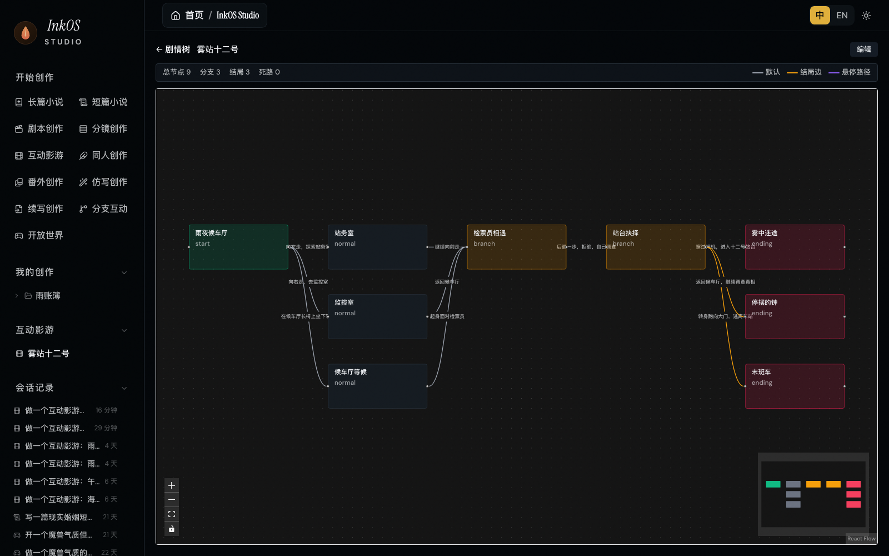
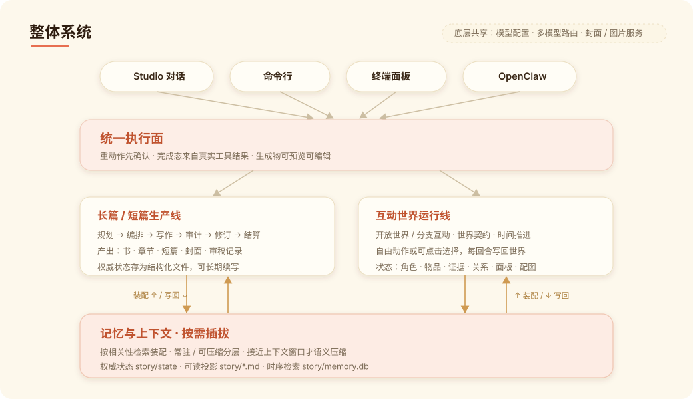
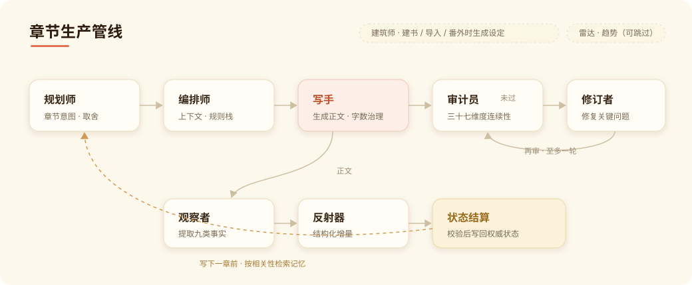
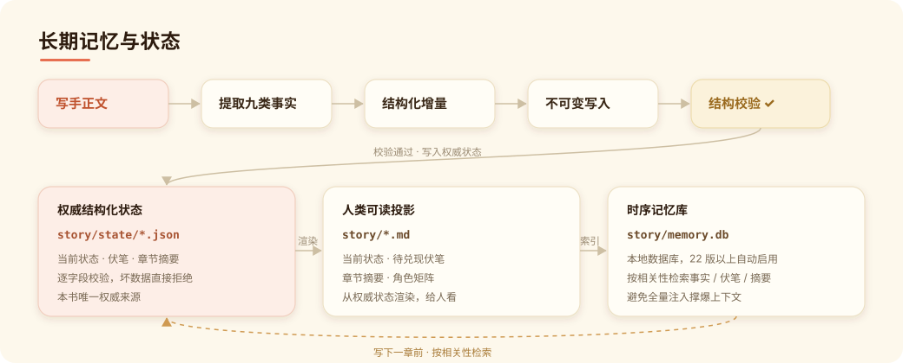
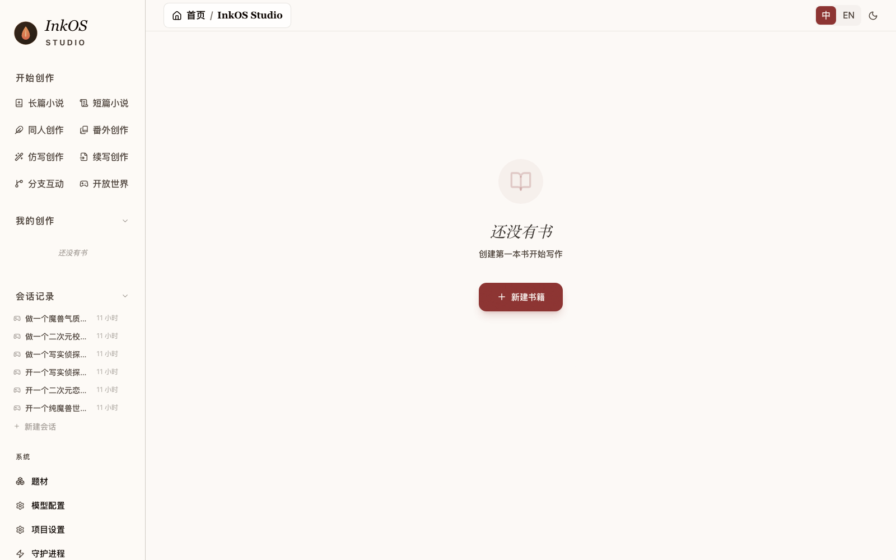

<p align="center">
  
  
</p>

<h1 align="center">Story Creation AI Agent<br><sub>長編・短編小説、脚本、インタラクティブ影遊、IP コンテンツ、多言語翻訳のための創作 AI Agent システム</sub></h1>

<p align="center">
  <a href="https://www.npmjs.com/package/@actalk/inkos"></a>
  <a href="LICENSE"></a>
  <a href="https://github.com/Narcooo/inkos/stargazers"></a>
  <a href="https://www.npmjs.com/package/@actalk/inkos"></a>
  <a href="https://clawhub.ai/narcooo/inkos"></a>
</p>

<p align="center">
  <picture>
    <source media="(prefers-color-scheme: dark)" srcset="https://kimi-file.moonshot.cn/prod-chat-kimi/kfs/4/1/2026-06-05/1d8h69mt3v89kkekg24gg">
    
  </picture>
</p>

<p align="center">
  <a href="README.md">中文</a> | <a href="README.en.md">English</a> | 日本語
</p>

---

InkOS は、物語創作と多言語翻訳のための AI Agent システムです。長編小説、独立短編、脚本、絵コンテ、二次創作、番外、文体模倣、続き書き、インタラクティブ影遊、インタラクティブ世界、長文翻訳を同じワークベンチから始められます。Studio Chat、CLI、TUI は同じ action surface を共有し、相談、確認、生成、レビュー、永続編集、言語をまたぐ納品を一つの流れで扱えます。

> 💡 **主要モデルをキー 1 本で** —— InkOS には [**kkaiapi**](https://en.kkaiapi.com/) の併用がおすすめです。Claude / GPT / Gemini / DeepSeek / Kimi / Qwen / GLM と画像モデルを扱える OpenAI 互換ゲートウェイとして、base URL `https://api.kkaiapi.com/v1` をカスタムサービスに設定すれば、複数プロバイダーのアカウントを行き来せずに Studio でモデルを切り替えられます。

## v1.7 多言語創作、物語予測、中断しないコラボレーション

InkOS 1.7 は、言語をまたぐ納品、長編の未来予測、継続的な共同作業を同じ Agent ワークベンチに統合します。作品全体の翻訳、複数の非正史ルート比較、バックグラウンド執筆中の会話継続に加え、Chat から資料の読解、既存原稿の取り込み、プロンプト調整、章の修正、創作状態の安全な復元を行えます。

- **モデル設定** — Studio はサービス設定、モデルルーティング、表紙サービス、[kkaiapi](https://en.kkaiapi.com/) / OpenRouter などのモデル集約入口、カスタム OpenAI-compatible エンドポイントに対応します。
- **物語の複数ルート予測**：Studio Chat と CLI で現在の正史から 2-5 本の独立した未来を作成、再検証、選択し、章のビート、人物の決断、予想される変化、リスク、作者意図との一致度を比較できます。採用時に保存されるのは計画だけで、本文、基礎設定、物語状態を先に変更しません。
- **完全な翻訳ワークベンチ**：EPUB、テキスト型 PDF、TXT、Markdown を読み込み、章と意味段落ごとに翻訳します。用語集、対照レビュー報告、TXT / Markdown / EPUB 出力に対応し、Studio、Chat、`inkos translate init / run / export` が同じ機能を共有します。
- **クロスランゲージのネイティブ創作**：短編、脚本、絵コンテ、インタラクティブ影遊に英語向けプロンプト経路を追加し、Studio の動的表示と CLI の言語フォールバックも同時に整備しました。
- **添付、素材ライブラリ、編集可能なプロンプト**：Chat はテキスト、Markdown、画像を読み取れます。外部資料は evidence trace 付きで保存・検索でき、長編、Play、インタラクティブ影遊の prompt pack は Studio で確認・調整できます。
- **既存作品を実プロジェクトとして取り込み**：ローカルファイル、ディレクトリ、Chat 添付から章を取り込み、基礎設定を逆生成して章状態を再生します。原稿を一時的な文脈として読むだけではありません。
- **執筆中も会話を継続**：生成タスクはバックグラウンドで進み、会話を続けられます。タスクの中止、失敗メッセージの再試行、更新・再起動後の正確な進捗、完了状態、完全なツールカード復元に対応します。
- **制御可能なレビュー、修正、連続執筆**：strict / lenient / always の修正基準、プロジェクト単位・書籍単位の上書き、書籍ごとの自動 / 手動レビューに対応します。CLI に `inkos auto` と完了 / 失敗通知を追加し、修正が保存されない場合は前後の指標と未解決事項を表示します。
- **創作データと同時実行を保護**：書籍全体のバックアップ / 復元、最新章削除時の状態ロールバック、部分編集後の章インデックス文字数同期に対応します。古いロックは復旧し、同時書き込みは `BOOK_BUSY` を返し、完了判定は実際の tool result とファイルだけに基づきます。
- **モデル、インストール、クロスプラットフォーム動作を安定化**：内蔵 MiniMax 接続では思考内容を本文から既定で分離し、OpenRouter や kkaiapi などの動的サービスが静的モデル一覧に阻まれません。npm パッケージへの `workspace:*` 依存関係の漏出を修正し、操作詳細、通知、プロジェクトパスもプラットフォーム間で統一しました。

## v1.6.0 主要アップデート

v1.6.0 は、InkOS を開放世界 Play からさらにインタラクティブ影遊、脚本、分镜、Agent Skills、出典付きリサーチへ拡張する更新です。

- **インタラクティブ影遊**：分岐剧情、選択肢、変数 / フラグ、関係状態、エンディング、ノード画像、エクスポート可能なプロジェクトパッケージに対応。
- **Agent Skills**：標準 `SKILL.md` の専門ガイダンスと静的資料を利用できます。Chat Agent は現在のユーザー意図から `use_skill` を呼び出し、ユーザーは `@skill-id` で強制指定できます。InkOS 独自の Skill 形式やキーワード一致による機械的な起動は行いません。
- **出典付き Web リサーチ**：`research_web` が世界観、時代、職業、市場、事実確認の Markdown レポートを生成します。レポートは参考資料であり、それだけで canon や本文を書き換えません。
- **脚本 / 分镜ワークフロー**：Studio Chat から脚本、分镜、インタラクティブ影遊の作成を提案し、確認後にファイルとして保存して Studio 内で確認できます。
- **安定性修正**：章内の対象テキスト編集は軽い言い換えにも追従し、多章監査失敗で既存章索引を消さず、モデル / サービス切替後も active book を保持します。

この更新は v1.5 の方向性を継続します。重い操作は確認可能で、完了判定はモデルの文章ではなく tool result と実ファイルに基づき、物語コンテキストは無差別投入ではなく統治された形で使います。

<p align="center">
  
</p>

<p align="center">
  
  
  
  
</p>

**長編小説** — ブリーフから書籍を作成し、基礎設定、章の意図、コンテキスト、本文、レビュー、修正、状態更新まで管理します。長編でも制御を失わないように、コンテキストは protected / compressible に分けて扱います。

**物語の複数ルート予測** — 次章を書く前に、現在の正史から互いに独立した 2-5 本の未来ルートを生成し、章のビート、人物の決断、予想される変化、リスク、作者意図との一致度を Studio Chat で横並びに比較できます。ルートを採用しても保存されるのは `selected-branch-plan.md` だけで、本文、アウトライン、正史状態は変更されません。正史が変わると古い予測は stale として扱われます。

**InkOS Short** — Studio Chat と CLI から独立した短編パッケージを生成できます。完成本文、アウトライン記録、レビュー記録、あらすじ、セールスポイント、表紙プロンプト、表紙画像に対応します。

**InkOS Play** — 自然言語の世界契約から、開放世界や分岐型インタラクティブ物語を開始できます。時間の進み方、キャラクター agent、所持品、証拠、関係性、シーン状態、ビジュアルルール、自由行動、選択肢、画像生成に対応します。

**インタラクティブ影遊** — アイデア、脚本、または小説素材から、分岐シーン、変数、エンディング、画像プロンプト、ノード画像、エクスポート可能なプロジェクトを生成します。

**Studio Chat** — 質問応答だけでなく、長編作成、Short、表紙生成、Play、永続テキスト編集を扱います。重いアクションは確認してから実行し、ツール結果がないのに成功したとは扱いません。

**Agent Skills とリサーチ** — `.agents/skills/`、標準 AgentSkills / OpenClaw ディレクトリ、または Studio のフォルダー導入から標準 `SKILL.md` を追加できます。Chat Agent は意図に応じて利用し、`@skill-id` で強制使用もできます。外部 skill のスクリプトは自動実行しません。外部事実が必要な場合は出典付き Markdown リサーチレポートを生成できます。

<p align="center">
  
</p>

**英語ネイティブ小説執筆に対応！** — 10種類の英語ジャンルプロファイルを内蔵し、専用のペーシングルール、疲労語リスト、監査ディメンションを搭載。`--lang en` を設定するだけですぐに始められます。

## クイックスタート

### インストール

```bash
npm i -g @actalk/inkos
```

### OpenClaw 🦞 経由で使用

InkOS は [OpenClaw](https://clawhub.ai/narcooo/inkos) Skill として公開されており、互換エージェント（Claude Code、OpenClaw など）から呼び出し可能です：

```bash
clawhub install inkos          # ClawHub からインストール
```

npm でインストール済み、またはリポジトリをクローン済みの場合、`skills/SKILL.md` が含まれているため、ClawHub の別途インストールなしで 🦞 が直接読み取れます。

インストール後、Claw は共有インタラクション入口を優先してください：

```bash
inkos interact --json --message "continue the current book, but keep the pacing tighter"
```

この入口はプロジェクト TUI と同じ会話実行カーネルを使います。現在の JSON 出力には assistant の返信と interaction session が含まれます。実際に完了したかどうかは、モデルの文章ではなく、ツール結果と生成ファイルで判断します。`plan` / `compose` / `draft` / `audit` / `revise` / `write next` などのアトミックコマンドも、スクリプトや上級者向けの下位ツールとして残っています。

### 設定

InkOS は設定経路を分けています。**Studio は可視化されたサービス設定**を使い、**CLI / daemon / デプロイ環境は env オーバーライド**を使えます。両者は暗黙に上書きしません。

**方法1：Studio サービス設定（ローカル執筆に推奨）**

```bash
inkos init my-novel
cd my-novel
inkos
```

Studio を開き、**モデル設定**へ進みます：

1. Google Gemini、Moonshot、MiniMax、DeepSeek、kkaiapi、OpenRouter、またはカスタムエンドポイントを選択。
2. API Key を貼り付けて接続をテスト。
3. 利用可能なモデルを選んで保存。
4. Studio Chat または書籍ページに戻って創作を開始。

Studio はプロジェクトのサービス設定と `.inkos/secrets.json` を使います。env が検出されてもヒントとして表示するだけで、Studio で選んだ service / model / base URL / API Key を上書きしません。

MiniMax は公式 OpenAI-compatible `/v1/chat/completions` エンドポイントを使用します。InkOS は `MiniMax-M3*` の thinking 返却をデフォルトで無効化します。M2.x の thinking は上流サービス側の制限により無効化できません。

**方法2：CLI / daemon / デプロイ環境の env 設定**

```bash
inkos config set-global \
  --lang en \
  --provider <openai|anthropic|custom> \
  --base-url <APIエンドポイント> \
  --api-key <APIキー> \
  --model <モデル名>

# provider: openai / anthropic / custom（OpenAI互換プロキシにはcustomを使用）
# base-url: APIプロバイダーURL
# api-key: APIキー
# model: モデル名
```

`--lang en` は CLI / daemon 実行時のデフォルト執筆言語を英語に設定します。`~/.inkos/.env` に保存されます。

グローバル `~/.inkos/.env` またはプロジェクト `.env` を手動で編集することもできます：

```bash
# 必須
INKOS_LLM_PROVIDER=                               # openai / anthropic / custom（OpenAI互換APIにはcustomを使用）
INKOS_LLM_BASE_URL=                               # APIエンドポイント
INKOS_LLM_API_KEY=                                 # APIキー
INKOS_LLM_MODEL=                                   # モデル名

# 言語（グローバル設定またはジャンルのデフォルトに準拠）
# INKOS_DEFAULT_LANGUAGE=en                        # en または zh

# オプション
# INKOS_LLM_TEMPERATURE=0.7                       # Temperature
# INKOS_LLM_THINKING_BUDGET=0                      # Anthropic拡張思考バジェット
```

CLI の解決順序は、Studio/project サービス設定、サービス secrets、グローバル env、プロジェクト env、プロセス env、CLI フラグです。つまり CLI は Studio で設定したサービスを再利用でき、env やコマンドライン引数は明示的な上書きとして扱われます。

**方法3：マルチモデルルーティング（オプション）**

異なるエージェントに異なるモデルを割り当て、品質とコストのバランスを調整：

```bash
# 異なるエージェントに異なるモデル/プロバイダーを割り当て
inkos config set-model writer <model> --provider <provider> --base-url <url> --api-key-env <ENV_VAR>
inkos config set-model auditor <model> --provider <provider>
inkos config show-models        # 現在のルーティングを表示
```

明示的なオーバーライドがないエージェントはグローバルモデルにフォールバックします。

### 現在のインタラクション入口

**Studio Chat + CLI + TUI は同じ実行面を共有します**

- **Studio Chat**：相談、書籍作成、Short、表紙、Play、永続ファイル編集を一つのチャット入口から扱えます。重い操作は確認カードを表示します。
- **創作入口**：長編、短編、二次創作、番外、文体模倣、続き書き、分岐インタラクション、開放世界を Studio の上部入口から開始できます。
- **TUI ダッシュボード**：`inkos tui` でキーボード中心のフルスクリーン端末 UI を開けます。
- **外部 Agent 入口**：`inkos interact --json --message "..."` は OpenClaw など外部 agent 向けの構造化入口です。
- **アトミックコマンド**：`plan` / `compose` / `draft` / `audit` / `revise` / `write next` はスクリプトや上級者向けに残っています。

### 最初の本を書く

英語ジャンルプロファイルではデフォルトで英語が使用されます。ジャンルを選んで始めましょう：

```bash
inkos book create --title "The Last Delver" --genre litrpg     # LitRPG小説（デフォルトで英語）
inkos write next my-book          # 次の章を執筆（フルパイプライン：draft → audit → revise）
inkos status                      # ステータスを確認
inkos review list my-book         # 下書きをレビュー
inkos review approve-all my-book  # 一括承認
inkos export my-book --format epub  # EPUB形式でエクスポート（スマホ/Kindleで読める）
```

言語はジャンルごとにデフォルトで設定されます。`--lang en` または `--lang zh` で明示的に上書き可能です。`inkos genre list` で利用可能なすべてのジャンルとデフォルト言語を確認できます。

### 完成短編を書く

Studio のチャットでは、次のように依頼できます：

```text
現代の結婚リバーサルを題材に、主人公が証拠で逆転する12章の短編を書いて。
```

CLI からも実行できます：

```bash
inkos short run \
  --direction "modern short fiction marriage reversal evidence-driven heroine" \
  --chapters 12 \
  --chars 1000
```

生成物は `shorts/<story-name>/final/` に保存され、`full.md`、`sales-package.md`、`cover-prompt.md`、表紙生成が設定済みの場合は `cover.png` が含まれます。

### 表紙だけを作る

既存タイトルやあらすじに対して表紙だけを作る場合は、短編本文を再生成せず、Studio チャットで直接依頼できます：

```text
「彼が後悔した離婚届」の短編表紙を作って。現代都市、強い逆転感。
```

表紙ツールは `covers/<title>/cover-prompt.md` と `covers/<title>/cover.png` を生成します。表紙サービス未設定の場合は、先に Studio のモデル設定で表紙サービスと API Key を設定してください。

生成後もチャットで表紙プロンプトを調整できます。例：「人物をもっと近く、タイトル文字を大きく、冷たい笑みにして」。InkOS は新しい指示を `coverPrompt` として渡し、`cover-prompt.md` を更新して表紙を再生成します。本文を書き直す必要はありません。

<p align="center">
  
  
  
</p>

### 開放世界 / 分岐型インタラクションを始める

Studio Chat で **Open World** または **Branching Interactive** を選び、自然言語で世界を説明します：

```text
Warcraft 風の国境見張り塔を舞台にした開放世界を作って。時間は固定ターンではなく、巡回は1時間、訓練は数日かかる。装備には希少感があるが、数値表は使わず、素材・光沢・雰囲気で表現する。
```

InkOS は世界、キャラクター、アイテム、証拠、関係性、現在シーン、候補アクションを生成します。Open World は自由入力の行動に対応し、Branching Interactive はクリック可能な選択肢を提示します。画像生成を設定すると、キャラクター、アイテム、証拠、シーン画像をチャットの流れの中で表示できます。

---

## 英語ジャンルプロファイル

InkOS には10種類の英語ネイティブジャンルプロファイルが同梱されています。各プロファイルにはジャンル固有のルール、ペーシング、疲労語検出、監査ディメンションが含まれます：

| ジャンル | 主要メカニクス |
|---------|--------------|
| **LitRPG** | 数値システム、パワースケーリング、ステータス成長 |
| **プログレッションファンタジー** | パワースケーリング、数値システム不要 |
| **異世界転生（Isekai）** | 時代考証、世界観の対比、文化的な異邦人体験 |
| **修行もの（Cultivation）** | パワースケーリング、境地の進行 |
| **システムアポカリプス** | 数値システム、サバイバルメカニクス |
| **ダンジョンコア** | 数値システム、パワースケーリング、領地管理 |
| **ロマンタジー** | 感情アーク、二重視点ペーシング |
| **SF** | 時代考証、技術の一貫性 |
| **タワークライマー** | 数値システム、階層進行 |
| **コージーファンタジー** | ローステークスペーシング、コンフォートファーストのトーン |

バイリンガルクリエイター向けに、5種類の中国語Web小説ジャンル（玄幻、仙侠、都市、ホラー、その他）にも対応しています。

すべてのジャンルに **疲労語リスト** が含まれています（例：LitRPGの場合 "delve"、"tapestry"、"testament"、"intricate"、"pivotal"）。監査エージェントがこれらを自動的にフラグ付けするため、他のAI生成小説と同じような文体になるのを防ぎます。

---

## 主な機能

### Studio Chat + Action Surface

Studio Chat は単なる Q&A ではありません。長編作成、Short、表紙生成、Play 起動、永続テキストファイル編集を扱い、重いアクションの前に確認を出します。普通の相談は普通に回答し、明確な創作アクションだけがツール実行になります。

### InkOS Play：開放世界と分岐インタラクション

Play は、キャラクター、場所、アイテム、証拠、関係性、時間、現在シーン、HUD、画像を含む持続的な世界状態を管理します。固定 RPG システムではありません。修仙世界なら希少度や境界、恋愛ものなら感情段階、探偵ものなら証拠のライフサイクルを、ユーザーの世界契約として状態に保存できます。

### 37次元監査 + 脱AI化

継続性監査エージェントがすべての下書きを37の次元でチェックします：キャラクターの記憶、リソースの継続性、フック回収、アウトライン準拠、ナラティブペーシング、感情アークなど。内蔵のAI痕跡検出が「LLMの声」を自動的に捕捉 — 使いすぎの単語、単調な文型、過度な要約。デフォルトの長編執筆チェーンでは自動修正は最大1回まで行い、残った重大問題は結果に残して人間レビューまたは後続コマンドに渡します。

脱AI化ルールはWriterエージェントのプロンプトに組み込まれています：疲労語リスト、禁止パターン、スタイルフィンガープリント注入 — ソースレベルでAI痕跡を削減。`revise --mode anti-detect` で既存の章に対して専用の脱AI検出リライトを実行できます。

### 文体クローニング

`inkos style analyze` で参考テキストを分析し、統計的なフィンガープリント（文長分布、語頻度パターン、リズムプロファイル）とLLM可読のスタイルガイドを抽出。`inkos style import` でこのフィンガープリントを書籍にインジェクト — 以降のすべての章がその文体を採用し、修正エージェントが文体に対して監査を行います。

### クリエイティブブリーフ

`inkos book create --brief my-ideas.md` — ブレインストーミングノート、世界観設定書、キャラクターシートを渡せます。アーキテクトエージェントがゼロから生成するのではなく、ブリーフを基に構築（`story_bible.md` と `book_rules.md` を生成）し、ブリーフを `story/author_intent.md` に永続化して、初期化後も書籍の長期的な意図が失われないようにします。

### 入力ガバナンスコントロールサーフェス

すべての書籍に2つの長期保存型Markdownコントロールドキュメントが付属：

- `story/author_intent.md`：この書籍が長期的にどうあるべきか
- `story/current_focus.md`：次の1〜3章で注意を引き戻すべき事柄

執筆前に以下を実行できます：

```bash
inkos plan chapter my-book --context "まずメンターとの対立に注意を引き戻す"
inkos compose chapter my-book
```

これにより `story/runtime/chapter-XXXX.intent.md`、`context.json`、`rule-stack.yaml`、`trace.json` が生成されます。`intent.md` は人間が読める契約書で、その他は実行/デバッグ用のアーティファクトです。`plan` は LLM を呼び出して章の意図を作成します。`compose` はローカルドキュメントとステートのコンパイルのみを行うため、APIキーの設定完了前でも実行できます。

### 文字数管理

`draft`、`write next`、`revise` は同じ保守的な文字数ガバナーを共有：

- `--words` は正確なハード制限ではなく、目標バンドを設定
- 中国語の章はデフォルトで `zh_chars`、英語の章はデフォルトで `en_words` を使用
- 章がソフトバンドから逸脱した場合、InkOS はプロを乱暴にカットするのではなく、1回の補正正規化パス（圧縮または拡張）を実行する場合があります
- 1回のパス後もハードレンジを外れる場合、InkOS は保存しますが、結果とチャプターインデックスに可視的な文字数警告とテレメトリを表示

### 続編執筆

`inkos import chapters` で既存の小説テキストをインポートし、構造化状態、章サマリー、フック、キャラクター関係、人間が読める Markdown プロジェクションを自動で再構築。`Chapter N` とカスタム分割パターンに対応し、再開可能なインポートをサポート。インポート後、`inkos write next` で物語を継続できます。

### 二次創作

`inkos fanfic init --from source.txt --mode canon` で原作素材から二次創作書籍を作成。4つのモード：canon（忠実な続編）、au（パラレルワールド）、ooc（キャラクター崩壊）、cp（カップリング重視）。原作インポーター、二次創作専用の監査ディメンション、設定の一貫性を保つ情報境界管理を搭載。

### マルチモデルルーティング

異なるエージェントに異なるモデルとプロバイダーを使用可能。WriterにClaude（より強力なクリエイティブ）、AuditorにGPT-4o（安価で高速）、Radarにローカルモデル（コストゼロ）。`inkos config set-model` でエージェントごとに設定可能；未設定のエージェントはグローバルモデルにフォールバック。

### デーモンモード + 通知

`inkos up` で自律的なバックグラウンドループを開始し、スケジュールに従って章を執筆。処理可能な非重要問題は自動で進め、人間の判断が必要な場合はレビュー可能な結果を残して一時停止します。TelegramとWebhook（HMAC-SHA256署名 + イベントフィルタリング）による通知。`inkos.log`（JSON Lines）にログ出力、`-q` でクワイエットモード。

### ローカルモデル互換性

任意のOpenAI互換エンドポイント（`--provider custom`）に対応。ストリーム自動フォールバック — SSEがサポートされていない場合、InkOS は自動的に同期モードでリトライ。フォールバックパーサーが小型モデルの非標準出力を処理し、ストリーム中断時には部分コンテンツリカバリが作動。

### 信頼性

章ごとに自動ステートスナップショットを作成 — `inkos write rewrite` で任意の章を執筆前の状態にロールバック可能。Writerは執筆前チェックリスト（コンテキストスコープ、リソース、保留中のフック、リスク）と執筆後決済テーブルを出力し、Auditorが両方をクロスバリデーション。ファイルロックにより同時書き込みを防止。執筆後バリデーターにはクロスチャプター反復検出と十数のハードルールによる自動スポット修正を搭載。

フックシステムはZodスキーマバリデーションを使用 — `lastAdvancedChapter` は整数、`status` は open/progressing/deferred/resolved のみ。LLMからのJSONデルタは `applyRuntimeStateDelta`（イミュータブル更新）と `validateRuntimeState`（構造チェック）を経て永続化。破損データは伝播されず、拒否されます。

モデル出力上限は provider bank のモデルカードで管理されます。`llm.extra` の予約キー（max_tokens、temperature、model、messages、stream など）は自動的に除去され、コアリクエストパラメータの意図しない上書きを防止します。

---

## 仕組み

InkOS には二つの主要な実行線があります。長編 / 短編の生産線は納品可能な本文を作り、Play は持続的なインタラクティブ世界を進めます。どちらも Studio Chat、モデル設定、確認アクション、成果物プレビューを共有しますが、状態モデルは異なります。

<p align="center">
  
</p>

長編の各章は複数のエージェントが順次処理します：

<p align="center">
  
</p>

| エージェント | 担当 |
|-------------|------|
| **Radar** | プラットフォームのトレンドと読者の好みをスキャンして物語の方向性に反映（プラグイン可能、スキップ可能） |
| **Planner** | 著者の意図 + 現在のフォーカス + メモリ取得結果を読み取り、章の意図（必須保持 / 必須回避）を生成 |
| **Composer** | 構造化状態、制御ドキュメント、Markdownプロジェクションからタスクに関連するコンテキストを選択し、ルールスタックとランタイムアーティファクトをコンパイル |
| **Architect** | 書籍作成・インポート・スピンオフ初期化時に基盤ファイルを生成：物語フレーム、ルール、キャラクター、長期制御ファイル |
| **Writer** | コンパイル済みコンテキストから散文を生成（文字数管理、対話駆動） |
| **Observer** | 章テキストから9カテゴリのファクトを過剰抽出（キャラクター、ロケーション、リソース、関係性、感情、情報、フック、時間、身体状態） |
| **Reflector** | JSONデルタを出力（フルMarkdownではない）；コードレイヤーがZodスキーマバリデーション後にイミュータブル書き込みを実行 |
| **Normalizer** | 章が hard range から明確に外れた場合のみ、1パスで圧縮/拡張 |
| **Continuity Auditor** | 構造化状態、制御ドキュメント、章コンテキストに対して下書きを検証 |
| **Reviser** | 監査で発見された重大問題を修正。デフォルトの執筆チェーンでは自動修正は最大1回までで、その他は人間レビュー用にフラグ付け |

監査に失敗すると、デフォルトのパイプラインは修正→再監査を1回だけ実行します。残った問題は結果と状態に保持され、人間レビューまたは後続コマンドで扱います。

### 長期記憶

各書籍の正規記憶は三つの層に分かれています：

| 層 | 目的 |
|----|------|
| `story/state/*.json` | 正規の構造化状態：現在状態、フック、章サマリーなど。Zodスキーマで検証 |
| `story/*.md` | 人間が読めるプロジェクション：`current_state.md`、`pending_hooks.md`、`chapter_summaries.md`、`character_matrix.md` など |
| `story/memory.db` | Node 22+ で自動有効化される SQLite 時系列メモリ。ファクト、フック、サマリーの関連性検索に使用 |

継続性監査エージェントが下書きをこれらの状態に対してチェックします。キャラクターが目撃していないことを「覚えて」いたり、2章前に失った武器を取り出したりすると、監査エージェントがそれを検出します。

Settler はフル Markdown ファイルをモデルに出力させず、JSON デルタを生成します。コードレイヤーがそれをイミュータブルに適用し、構造検証してから永続化します。Markdown は人間が読めるプロジェクションとして保持されます。既存書籍は初回実行時に legacy Markdown から自動移行します。

Node 22+ では、SQLite時系列メモリデータベース（`story/memory.db`）が自動的に有効化され、過去のファクト、フック、チャプターサマリーの関連性ベースの取得をサポート — ファイル全量注入によるコンテキスト肥大化を防止。

<p align="center">
  
</p>

### コントロールサーフェスとランタイムアーティファクト

ランタイム状態に加え、InkOS はガードレールをカスタマイズからレビュー可能なコントロールドキュメントに分離します：

- `story/author_intent.md`：長期的な著者の意図
- `story/current_focus.md`：短期的なステアリング
- `story/runtime/chapter-XXXX.intent.md`：章の目標、保持/回避リスト、対立の解決
- `story/runtime/chapter-XXXX.context.json`：この章のために選択された実際のコンテキスト
- `story/runtime/chapter-XXXX.rule-stack.yaml`：優先度レイヤーとオーバーライド関係
- `story/runtime/chapter-XXXX.trace.json`：この章のコンパイルトレース

つまり、ブリーフ、アウトラインノード、ブックルール、現在のリクエストが1つのプロンプトブロブに混ぜ合わされることはなくなりました。InkOS はまずコンパイルし、それから執筆します。

### 執筆ルールシステム

Writerエージェントには約25の汎用執筆ルール（キャラクタークラフト、ナラティブテクニック、論理的一貫性、言語制約、脱AI化）があり、すべてのジャンルに適用されます。

その上に、各ジャンルには専用ルール（禁止事項、言語制約、ペーシング、監査ディメンション）があり、各書籍には独自の `book_rules.md`（主人公の性格、数値上限、カスタム禁止事項）、`story_bible.md`（世界観設定）、`author_intent.md`（長期的な方向性）、`current_focus.md`（短期的なステアリング）があります。`volume_outline.md` はデフォルトプランとして機能しますが、v2入力ガバナンスでは現在の章の意図を自動的にオーバーライドしなくなりました。

## 使用モード

InkOS は4つのインタラクションモードを提供し、すべて同じアトミック操作を共有します：

### 1. フルパイプライン（ワンコマンド）

```bash
inkos write next my-book              # Draft → audit → 自動修正、すべて一括
inkos write next my-book --count 5    # 5章連続で執筆
```

`write next` はデフォルトで `plan -> compose -> write` ガバナンスチェーンを使用します。以前のプロンプトアセンブリパスが必要な場合は、`inkos.json` で明示的に設定してください：

```json
{
  "inputGovernanceMode": "legacy"
}
```

デフォルトは `v2` になりました。`legacy` は明示的なフォールバックとして引き続き利用可能です。

### 2. アトミックコマンド（コンポーザブル、外部エージェントフレンドリー）

```bash
inkos plan chapter my-book --context "まずメンターとの対立にフォーカス" --json
inkos compose chapter my-book --json
inkos draft my-book --context "ダンジョンボス戦とパーティダイナミクスにフォーカス" --json
inkos audit my-book 31 --json
inkos revise my-book 31 --json
```

各コマンドは単一の操作を独立して実行。`--json` で構造化データを出力。`plan` / `compose` は入力を管理し、`draft` / `audit` / `revise` は散文と品質チェックを処理。外部AIエージェントから `exec` 経由で呼び出し可能で、スクリプトでも使用できます。

### 3. 自然言語エージェントモード

```bash
inkos agent "ダンジョン世界のヒーラークラスのMCを持つLitRPG小説を書いて"
inkos agent "次の章を書いて、ボス戦と戦利品の分配にフォーカス"
inkos agent "1つの呪文しか使えない魔法使いのプログレッションファンタジーを作成して"
```

Agent モードは現在の session 種別に応じてツールを絞ります。書籍作成、コントロールサーフェス編集、計画、コンテキスト編成、執筆、監査、修正、Short、表紙、Play は、必要な場面でだけ利用可能になります。推奨フローは、まずコントロールサーフェスを調整し、次に `plan` / `compose`、最後にドラフトのみかフルパイプライン執筆を選ぶ形です。

### 4. Studio Play モード

Studio の **Open World** と **Branching Interactive** は、先に書籍を作らなくても開始できるインタラクティブ創作入口です。世界の動き方、時間の進み方、キャラクターが agent として動くか、アイテムや証拠がどう効くかを説明すると、InkOS は継続可能なローカル世界状態として保存します。

## Studio スクリーンショットと実行結果

<p align="center">
  
</p>

<p align="center">
  
  
  
  
</p>

最初の画像はローカル Studio のスクリーンショットです。ほかの画像は InkOS Short と InkOS Play のローカル実行で生成された実例で、短編表紙、開放世界シーン、探偵証拠ビジュアル、アイテム画像を示します。

## CLIリファレンス

| コマンド | 説明 |
|---------|------|
| `inkos init [name]` | プロジェクトを初期化（nameを省略するとカレントディレクトリを初期化） |
| `inkos book create` | 新しい書籍を作成（`--genre`、`--chapter-words`、`--target-chapters`、`--brief <file>`、`--lang en/zh`） |
| `inkos book update [id]` | 書籍設定を更新（`--chapter-words`、`--target-chapters`、`--status`、`--lang`） |
| `inkos book list` | すべての書籍を一覧表示 |
| `inkos book delete <id>` | 書籍とそのすべてのデータを削除（`--force` で確認をスキップ） |
| `inkos genre list/show/copy/create` | ジャンルの表示、コピー、作成 |
| `inkos plan chapter [id]` | 次の章の `intent.md` を生成（`--context` / `--context-file` で現在のステアリング） |
| `inkos compose chapter [id]` | 次の章の `context.json`、`rule-stack.yaml`、`trace.json` を生成 |
| `inkos write next [id]` | フルパイプライン：次の章を執筆（`--words` でオーバーライド、`--count` でバッチ、`-q` クワイエットモード） |
| `inkos write rewrite [id] <n>` | 第N章をリライト（ステートスナップショットを復元、`--force` で確認をスキップ） |
| `inkos draft [id]` | ドラフトのみ執筆（`--words` で文字数をオーバーライド、`-q` クワイエットモード） |
| `inkos audit [id] [n]` | 特定の章を監査 |
| `inkos revise [id] [n]` | 特定の章を修正 |
| `inkos agent <instruction>` | 自然言語エージェントモード |
| `inkos review list [id]` | 下書きをレビュー |
| `inkos review approve-all [id]` | 一括承認 |
| `inkos status [id]` | プロジェクトのステータス |
| `inkos export [id]` | 書籍をエクスポート（`--format txt/md/epub`、`--output <path>`、`--approved-only`） |
| `inkos radar scan` | 新規書籍の方向性に使う市場 / トレンド入力をスキャン |
| `inkos fanfic init` | 原作素材から二次創作書籍を作成（`--from`、`--mode canon/au/ooc/cp`） |
| `inkos short run` | 独立短編パッケージを生成 |
| `inkos eval [id]` | 品質評価レポートを生成（`--json`、章範囲指定） |
| `inkos consolidate [id]` | 長編の章要約を統合し、コンテキスト負荷を下げる |
| `inkos forecast create/show/select` | 長編の非正史ルートを生成・再検証・選択。選択時は候補計画だけを保存し、正史は変更しない |
| `inkos interact` | 外部 agent / CLI 自然言語入口（`--json`、`--message`、`--book`） |
| `inkos config set-global` | グローバルLLM設定を設定（~/.inkos/.env） |
| `inkos config set-model <agent> <model>` | エージェントごとのモデルオーバーライド（`--base-url`、`--provider`、`--api-key-env`） |
| `inkos config show-models` | 現在のモデルルーティングを表示 |
| `inkos doctor` | セットアップの問題を診断（API接続テスト + プロバイダー互換性ヒント） |
| `inkos detect [id] [n]` | AIGC検出（`--all` で全章、`--stats` で統計） |
| `inkos style analyze <file>` | 参考テキストを分析してスタイルフィンガープリントを抽出 |
| `inkos style import <file> [id]` | スタイルフィンガープリントを書籍にインポート |
| `inkos import canon [id] --from <parent>` | 番外 / スピンオフ用に親作品の正典を導入 |
| `inkos import chapters [id] --from <path>` | 続編執筆用に既存の章をインポート（`--split`、`--resume-from`） |
| `inkos analytics [id]` / `inkos stats [id]` | 書籍分析（監査合格率、主要な問題、章ランキング、トークン使用量） |
| `inkos update` | 最新バージョンへ更新 |
| `inkos` / `inkos studio` | Webワークベンチを起動（`-p` でポート指定、デフォルト4567） |
| `inkos tui` | 端末フルスクリーン TUI を起動 |
| `inkos up / down` | デーモンの開始/停止（`-q` クワイエットモード、`inkos.log` に自動出力） |

`[id]` はプロジェクトに書籍が1つしかない場合に自動検出されます。すべてのコマンドが `--json` による構造化出力に対応。`draft` / `write next` / `plan chapter` / `compose chapter` は `--context` でステアリング可能、`--words` で目標章サイズをオーバーライド。`book create` は `--brief <file>` でクリエイティブブリーフを渡せます — アーキテクトがゼロから生成するのではなく、あなたのアイデアを基に構築します。`plan chapter` は LLM を呼び出して章の意図を作成します。`compose chapter` はライブLLMを必要としないため、APIセットアップ完了前でも管理された入力を確認できます。

## ロードマップ

- [x] ~~`packages/studio` Webワークベンチ（Vite + React + Hono）~~ — リリース済み、`inkos` または `inkos studio` で起動
- [x] ~~インタラクティブフィクション / 開放世界（分岐選択 + 自由行動 + 画像生成）~~ — Studio Play としてリリース済み
- [ ] 部分的な章介入（章の半分をリライト + 真実ファイルの連鎖更新）
- [ ] カスタムエージェントプラグインシステム

## コントリビューション

コントリビューション歓迎。IssueまたはPRを作成してください。

```bash
pnpm install
pnpm dev          # すべてのパッケージのウォッチモード
pnpm test         # テストを実行
pnpm typecheck    # 出力なしで型チェック
```

## Star History

<a href="https://www.star-history.com/#Narcooo/inkos&type=date&legend=top-left">
 <picture>
   <source media="(prefers-color-scheme: dark)" srcset="https://api.star-history.com/svg?repos=Narcooo/inkos&type=date&theme=dark&legend=top-left" />
   <source media="(prefers-color-scheme: light)" srcset="https://api.star-history.com/svg?repos=Narcooo/inkos&type=date&legend=top-left" />
   
 </picture>
</a>

## Skills Download History

<div align="center">

<a href="https://skill-history.com/narcooo/inkos">
  
</a>

</div>

## Repobeats


## 謝辞

InkOS のエージェントランタイムは Mario Zechner 氏の [pi](https://github.com/badlogic/pi-mono)（`@mariozechner/pi-ai` と `@mariozechner/pi-agent-core`）の上に構築されています。堅実な土台を提供してくれた pi に感謝します。

## ライセンス

[AGPL-3.0](LICENSE)
